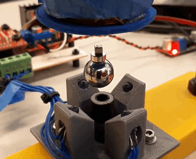
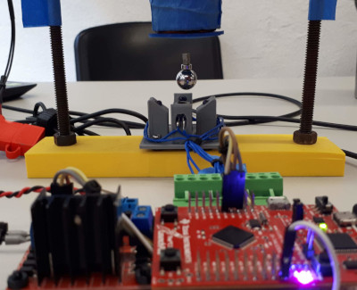
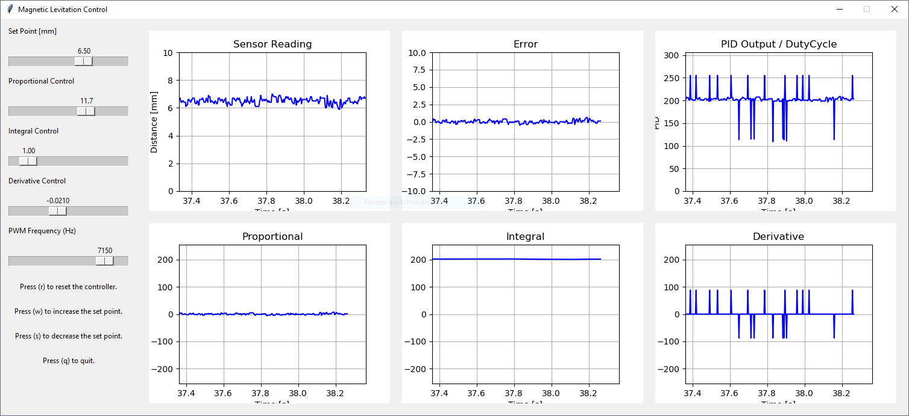
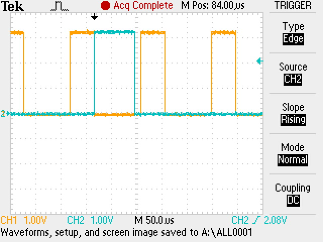
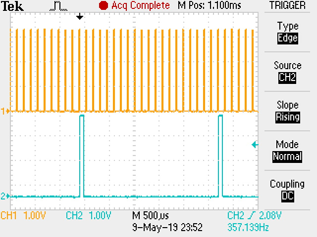
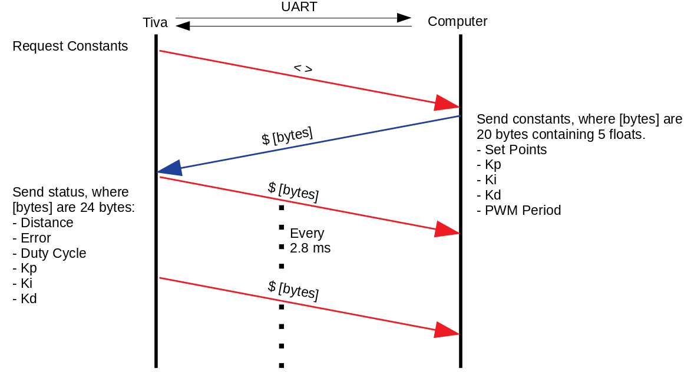

# Magnetic Levitation Control System

Magnetic levitation real time control system running on a Tiva TM4C123G microcontroller. The control settings and output can be displayed and controlled via a Python Tkinter interface.

    
    

The Real Time Operating System is running on the Tiva board, ensuring that every 140 us (7.14 kHz) the control signal of the coil is updated.

    

### 1. Required Software

The following software is required for running and developing the control system:
- TivaWare for C Series SW-TM4C (version 2.1.4.178) (http://www.ti.com/tool/SW-TM4C)
- Keil uVision5
- Python 3.6.4
- pySerial (https://pypi.org/project/pyserial/)
- matplotlib (https://matplotlib.org/)
- numpy (https://www.numpy.org/)

### 2. Developing a Real Time Operating System
A key aspect of developing a real time operating system (RTOS) is to guarantee that a series of tasks can be performed within a specified time frame. This ensures that tasks are always completed before their time limit (deadline), therefore ensuring the system can run smoothly. Some of the more complex real time operating systems allow for pre-emption and context changing. However, for this implementation these functions are not required. The key aspect is to develop code that runs within a specified time frame that doesn't extend over the period of the next task.

This operating system has three tasks:
- **controlTask**: reads the analog value, converts it to distance, calculates the PID output, and updates the duty cycle (period 140 us).
- **sendTask**: sends to the Python interface the current distance, error, duty cycle, and PID output (proportional, integral, and derivative control) (period 2.8 ms).
- **receiveTask**: checks if there is data available from the Python Interface, receives PID constants and updates them (does not have a period).

### 2.1 Scheduler
A scheduler is a critical component in a RTOS that determines which is the next task to run. On this RTOS a simplified version of a scheduler was implemented. The fastest task on this system runs every 140 us. In order to keep track of this, an interrupt must be fired every 140 us in order to signal that it is time to execute the controlTask. This could easily be done via a Timer interrupt. Nonetheless, the TM4C series of microcontrollers has a dedicated timer that does exactly that. The timer is called System Timer or ‘SysTick’, and as the datasheet for this microcontroller states, it is an RTOS tick timer that fires at a programmable rate.

This interrupt is the only way to keep track of time in the RTOS that is being implemented. By counting how many times this interrupt is fired, one can program tasks that execute at desired multiples of 140 us. During the interrupt routine, a variable called ‘doControlFlag’ is set to true. On the main program loop, an if statement waits for this flag to be true. Once it is acknowledged, the execution of controlTask is started and the flag is changed back to false. This ensures that the controlTask is executed in the specified period of 140 us. It is also important to note that the interrupt routine is kept as short as possible, since it is not recommended to have many/long interrupts on a RTOS.

Every time the controlTask is executed, a variable called ‘counter’ is incremented by 1. When the counter reaches 20, the sendTask gets executed.  Since the period of the controlTask is fixed at 140 us, this causes the sendTask executes with a period of 2.8 ms. Once the sendTask gets executed the counter is reset back to 0.

### 2.2 Task Execution Time

An important part of developing an RTOS is to know the execution time of a task. Often this is done via software. However, since the SysTick timer is already being used for timing the controlTask, the solution to this must be done through other means. Nonetheless, in order to avoid configuring an extra interrupt for this, an arbitrarily chosen pin was toggled at the start and end of every task. Then the period of this signal was measured on the oscilloscope. The period of this signal is essentially the period of the task.

If the signal jittered or the period was not constant this meant that the RTOS couldn't accomplish its deadlines. On the other hand, if the signal remained constant, the RTOS was achieving its deadlines. Furthermore, by doing the same procedure on the sendTask and overlaying both signals on the oscilloscope, the total execution time of the controlTask and sendTask was verified to be smaller than the period of the controlTask.

Orange signal is the controlTask and cyan signal is the sendTask. Both tasks run within 140 us.

  
    

sendTask runs every 20 controlTask loops.  

    

### 2.4 Optimizing Code: Communication

As one can see, time is critical in a RTOS. Therefore, the code written must be as optimized as possible. One of the main bottlenecks on a system like this is the communication systems, which often run much slower than the control tasks. In this system, serial communications runs at a baud rate of 1,000,000. This means that sending a single frame of 10 bits (8 bits payload, 1 stop bit, no parity) would take about 10 us to send.  Therefore, every character sent adds up. If a more conservative baud rate were to be used, such as 9600, a single frame of 10 bits would take about 1 ms to send. This means that sending a single byte would cause the RTOS to miss about 8 execution cycles of the controlTask.

A special optimization was made on the code for sending floating point values to the computer. Usually, floats are converted to ASCII characters by approximating every decimal place of the number. However, this takes more execution time and bytes to send, and as time is critical here, this execution route is unviable. 

The Tiva TM4C series stores floating point values in memory by using 4 bytes or a single 32-bit value. This follows the IEEE 754 standard, which is the same as in Python. The sendTask takes the floating-point variables that will be sent and copies the values stored in memory to an output buffer. This buffer is then written to the serial interface. Then, the data is received by Python, and those four bytes received are reconstructed back into the floating-point value via the ‘struct’ library. This results in a more efficient communication system. By sending only four bytes a floating-point value that could be more than 10 digits long can be encoded.

Data flow between the Tiva C microcontroller and the computer.

    

### 3. PID Control
At the core of the operating system is the PID control loop. The theory behind this implementation is based on the guide published by Atmel. Nonetheless, some adjustments to correct for accuracy were made. Instead of estimating the derivative part of the system through a backwards difference, a central difference was used. This provided better stability.

References:
- http://ww1.microchip.com/downloads/en/AppNotes/Atmel-2558-Discrete-PID-Controller-on-tinyAVR-and-megaAVR_ApplicationNote_AVR221.pdf
- https://en.wikipedia.org/wiki/Finite_difference

### 4. Configuring Keil uVision
Eventhough a project file for Keil uVision is provided, it is also important to know to how configure a blank project to work with the Tiva microcontroller and to be able to use the TivaWare libraries. The following can be used as a guide for this: https://www.youtube.com/watch?v=v7tkCF-fZ10

### 5. License

This project is licensed under the MIT License - see the LICENSE file for details.